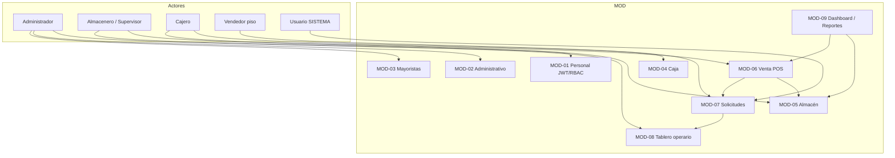

# ISV_INV_2026 — IV. Arquitectura de Componentes

> **Sistema:** DK-SYSTEM (Inventario y Ventas — Empresas de Moda)  
> **Repositorio:** `Desarrollo-de-Sistema-de-Ventas-Empresas-de-Moda`  
> **Stack:** Spring Boot 3 (`com.tienda.ropa`) + React 18 / Vite (`front-end/sistemaReact-Main`)  
> **Fuente:** Análisis estático del código — Mayo 2026

**Nota:** El repositorio no define constantes `MOD-01`…`MOD-09`. La numeración siguiente corresponde a la especificación funcional **ISV_INV_2026** y se mapea a paquetes y rutas reales del proyecto.

---

## MOD-01 — Personal

### 1. PROPÓSITO Y RESPONSABILIDAD (SRP)

Gestionar **cuentas operativas del personal** (alta, edición, habilitación), **autenticación stateless** con JWT y **control de acceso basado en roles (RBAC)** a nivel de prefijos de API y rutas React.

**Alcance implementado:** login, emisión/validación de token, asignación de uno o más roles por usuario, contraseña con política de complejidad (BCrypt), protección del último administrador activo y asignación de área de almacén para `ALMACENERO`.

**Fuera de alcance en código (respecto a la especificación):** no existe entidad de “perfil de personal” con DNI ni correo electrónico; no hay cifrado reversible ni validación de DNI/email para empleados. La consulta de DNI/RUC pertenece al flujo de **clientes** en ventas (`ClienteService`, `ApiExternoService`), no a usuarios internos.

### 2. COMPONENTES INTERNOS

| Capa | Clase/Componente | Responsabilidad |
|------|------------------|-----------------|
| Config | `SecurityConfiguration` | `SecurityFilterChain`, CORS, reglas `hasRole` / `hasAnyRole`, `BCryptPasswordEncoder` |
| Filtro | `JwtAuthenticationFilter` | Extrae Bearer JWT, valida con `JwtUtils`, carga `Usuario` en `SecurityContext` |
| Util | `JwtUtils` | Emisión/validación HMAC256; claim `authorities`; subject = nombre de usuario |
| Controller | `AuthenticationController` | `POST /api/autenticacion/signin` |
| Controller | `UsuarioController` | CRUD admin de usuarios bajo `api/admin/user` |
| Service | `AuthenticationService` / `AuthenticationServiceImpl` | Login, `signUpUser`, hash de contraseña |
| Service | `UsuarioService` / `UsuarioServiceImpl` | `UserDetailsService`, actualización, deshabilitar, roles, área almacén |
| Service | `RolService` | Resolución de roles en BD |
| Validación | `ContrasenaSegura`, `ContrasenaSeguraValidator` | Política de contraseña en `SignUpRequest` |
| Repository | `UsuarioRepository`, `RolRepository` | Persistencia `usuario`, `rol`, `usuario_rol` |
| Entity | `Usuario`, `Rol`, enum `Role` | Modelo de cuenta y autoridades `ROLE_*` |
| View | `LoginPage` | UI de inicio de sesión |
| View | `GestionUsuariosPage` | Alta/edición de cuentas, roles, área, protección último admin |
| Context | `AuthContext`, `authBootstrap.ts` | Sesión cliente, parseo de roles del JWT |
| Service (FE) | `UsuarioService.ts` | Cliente HTTP hacia `api/admin/user` |

### 3. CONTRATOS DE API

| Método HTTP | Endpoint | Códigos HTTP comunes |
|-------------|----------|----------------------|
| POST | `/api/autenticacion/signin` | 200, 400 (`@Valid`), 401 (`BadCredentialsException`) |
| POST | `api/admin/user/createUser` | 201, 400 |
| GET | `api/admin/user` | 200, 401, 403 |
| GET | `api/admin/user/with-roles` | 200, 401, 403 |
| GET | `api/admin/user/{id}/with-roles` | 200, 404, 403 |
| PUT | `api/admin/user/{id}` | 200, 400, 404, 409 (último admin) |
| PUT | `api/admin/user/deshabilitar/{id}` | 200, 404, 409, 400 |
| PUT | `api/admin/user/habilitar/{id}` | 200, 404, 403 |
| OPTIONS | `/**` | 200 (preflight CORS) |

### 4. FLUJO PRINCIPAL Y REGLAS DE NEGOCIO

**Autenticación:** `LoginPage` → `POST /api/autenticacion/signin` → `AuthenticationServiceImpl` valida credenciales con `passwordEncoder.matches` (BCrypt) y devuelve JWT. `JwtAuthenticationFilter` excluye `/api/autenticacion/**` y en el resto exige Bearer válido.

**RBAC:** `Usuario.getAuthorities()` mapea cada `Rol` a `ROLE_{nombreRol}`. Las reglas HTTP están centralizadas en `SecurityConfiguration` (no hay `@PreAuthorize` en `UsuarioController`).

**Alta de personal:** solo `ADMIN` vía `createUser` + `SignUpRequest` (un rol en creación; edición admite varios en `UsuarioDTO.roles`). Contraseña validada por `@ContrasenaSegura` y duplicada en `UsuarioServiceImpl.validarContrasenaSegura`.

**Validación DNI/correo (especificación):** **no implementada** para `Usuario`. La tabla `usuario` solo tiene `usuario` (login), `password`, `activo` y FK opcional a `ubicacion_area` (`V1__schema_completo.sql`).

**Encriptación (especificación):** **solo BCrypt irreversible** sobre `password` (`SecurityConfiguration.passwordEncoder`, `AuthenticationServiceImpl.signUpUser`). No hay `Cipher`, AES ni campos cifrados de DNI/email en personal.

### 5. SEGURIDAD DE ACCESO

| Recurso | Roles JWT requeridos |
|---------|----------------------|
| `/api/autenticacion/**` | Público |
| `api/admin/user/**` | `ROLE_ADMIN` (`hasRole("ADMIN")`) |
| Resto de API | Autenticado + rol según prefijo (ver módulos siguientes) |

| Ruta UI (`App.tsx`) | Rol |
|---------------------|-----|
| `/admin/usuarios` (`GestionUsuariosPage`) | `ROLE_ADMIN` |

Roles en BD: `ADMIN`, `ALMACENERO`, `CAJERO`, `VENDEDOR`, `GERENTE`, `SUPERVISOR_ALMACEN`. **`GERENTE` no tiene reglas `hasAnyRole` dedicadas** en `SecurityConfiguration`.

### 6. DEPENDENCIAS Y CONEXIONES

- **Tablas:** `usuario`, `rol`, `usuario_rol`, `ubicacion_area` (área asignada almacenero).
- **Transversal:** todos los módulos dependen del JWT y del usuario en `SecurityContext`.
- **MOD-04 (Caja):** identidad del cajero = `Principal` / usuario autenticado.
- **MOD-05 (Almacén):** filtro de catálogo por sector según `Usuario.areaAsignado`.

---

## MOD-02 — Administrativo

### 1. PROPÓSITO Y RESPONSABILIDAD (SRP)

Proveer **visibilidad gerencial** de ingresos y operación: dashboards con gráficos, tablas de actividad reciente y **módulo de reportes** con filtros temporales/categoría y **exportación a Excel** en el cliente.

No existe un paquete `administrativo`; la responsabilidad se reparte entre `DashboardAdminPage`, `ReportesPage` y `ReporteController`.

### 2. COMPONENTES INTERNOS

| Capa | Clase/Componente | Responsabilidad |
|------|------------------|-----------------|
| Controller | `ReporteController` | Agregaciones `/api/admin/reportes/*` |
| Controller | `VentaController` | Lectura de ventas para métricas (`/api/cajero/ventas`) |
| Controller | `UsuarioController` | Conteo/listado de personal en dashboard |
| Service | `ReporteService` | SQL agregado: top productos, por categoría, resumen |
| Service | `VentaService` (BE) | Persistencia y consultas de venta |
| Repository | `ReporteRepository` | Consultas analíticas |
| View | `DashboardAdminPage` | KPIs, gráfico semanal Recharts, actividad reciente (10 ventas), top clientes |
| View | `ReportesPage` | Contenedor de reportes tabulados |
| View | `ReporteDeVentas`, `ProductosMasVendidos`, `ReportePorCategoria`, `ResumenGeneral` | Gráficos + tablas + export |
| View | `RoseChart`, `chartRenderers.tsx` | Visualización avanzada |
| Service (FE) | `ReporteService.ts`, `VentaService.ts`, `UsuarioService.ts` | HTTP |

### 3. CONTRATOS DE API

| Método HTTP | Endpoint | Códigos HTTP comunes |
|-------------|----------|----------------------|
| GET | `/api/admin/reportes/productos-mas-vendidos` | 200, 400, 403 |
| GET | `/api/admin/reportes/productos-mas-vendidos/por-fecha` | 200, 400, 403 |
| GET | `/api/admin/reportes/por-categoria` | 200, 400, 403 |
| GET | `/api/admin/reportes/por-categoria/subcategorias` | 200, 400, 403 |
| GET | `/api/admin/reportes/por-categoria/segunda-subcategoria` | 200, 400, 403 |
| GET | `/api/admin/reportes/por-categoria/por-fecha` | 200, 400, 403 |
| GET | `/api/admin/reportes/resumen-completo` | 200, 400, 403 |
| GET | `/api/admin/reportes/producto/tallas` | 200, 400, 403 |
| GET | `/api/admin/reportes/producto/variantes-por-color` | 200, 400, 403 |
| GET | `/api/cajero/ventas` (y variantes por fecha/cliente) | 200, 401, 403 |
| GET | `api/admin/user` / `with-roles` | 200, 403 |

`ReporteController` declara `@PreAuthorize("hasRole('ADMIN')")` además del filtro global.

### 4. FLUJO PRINCIPAL Y REGLAS DE NEGOCIO

**Gráficos de ingresos filtrables:** `ReporteDeVentas` consulta `ReporteService` (FE) → endpoints de `ReporteController` con `fechaInicio`, `fechaFin`, categoría y período (diario/semanal/mensual). Renderiza con Recharts.

**Dashboard admin:** `DashboardAdminPage.cargarDatos()` agrega en cliente con `VentaService.obtenerTodasVentas()` — gráfico de **últimos 7 días fijos** (sin selector de rango en UI).

**Tablas de últimos registros:** actividad reciente (10 ventas) en dashboard; tablas paginadas y detalladas en componentes de `ReportesPage`.

**Exportación Excel:** librería **`xlsx` (SheetJS)** en frontend — `import * as XLSX from 'xlsx'` en `ReporteDeVentas.tsx`, `ProductosMasVendidos.tsx`, `ReportePorCategoria.tsx`, `ResumenGeneral.tsx`; generación con `XLSX.utils.json_to_sheet` y `XLSX.writeFile`. **No hay export server-side** (sin Apache POI en `pom.xml`).

**Brechas:** el dashboard **no exporta** a Excel; algunas rutas referenciadas en `ReporteService.ts` (FE) **no existen** en `ReporteController` (p. ej. endpoints de “ventas por período” dedicados si fueron definidos solo en cliente).

### 5. SEGURIDAD DE ACCESO

| Recurso | Roles |
|---------|-------|
| `/api/admin/reportes/**` | `ROLE_ADMIN` |
| `/api/admin/**` (resto) | `ROLE_ADMIN` |
| Lectura `/api/cajero/ventas` para dashboard | `ADMIN` (incluido en `hasAnyRole` de `/api/cajero/**`) |
| Ruta `/admin/reportes` | `ROLE_ADMIN` en `App.tsx` |

### 6. DEPENDENCIAS Y CONEXIONES

- **Tablas:** `venta`, `detalle_venta`, `cliente`, `producto`, `producto_variante`, `categoria`, `usuario`.
- **MOD-06 (Venta):** fuente de datos de ingresos.
- **MOD-01:** listado de usuarios en panel admin.

---

## MOD-03 — Mayoristas

### 1. PROPÓSITO Y RESPONSABILIDAD (SRP)

Registrar **clientes mayoristas** (nuevos o promovidos desde cliente existente) y **autogenerar un código mayorista único** persistido en BD, consultable por administración y verificable en POS por documento.

### 2. COMPONENTES INTERNOS

| Capa | Clase/Componente | Responsabilidad |
|------|------------------|-----------------|
| Controller | `MayoristaController` | API `/api/admin/mayoristas` |
| Controller | `ClienteController` | `GET .../es-mayorista` para cajero |
| Service | `MayoristaService` | CRUD, `generarCodigoMayorista`, unicidad |
| Service | `ClienteService` | Cliente base y consultas documento |
| Repository | `MayoristaRepository`, `ClienteRepository` | `mayorista`, `cliente` |
| Entity | `Mayorista`, `Cliente` | Relación 1:1 cliente–mayorista |
| View | `ModalHacerMayorista.tsx` | Alta/edición/revocación desde admin |
| View | `DashboardAdminPage.tsx` | CTA “Nuevo Mayorista” |
| Service (FE) | `MayoristaService.ts`, `ClienteService.ts` | HTTP admin y verificación POS |

### 3. CONTRATOS DE API

| Método HTTP | Endpoint | Códigos HTTP comunes |
|-------------|----------|----------------------|
| GET | `/api/admin/mayoristas` | 200, 403 |
| GET | `/api/admin/mayoristas/{id}` | 200, 404, 403 |
| GET | `/api/admin/mayoristas/codigo/{codigo}` | 200, 404, 403 |
| GET | `/api/admin/mayoristas/documento/{numeroDocumento}` | 200, 404, 403 |
| POST | `/api/admin/mayoristas` | 200, 400, 403 |
| POST | `/api/admin/mayoristas/cliente/{idCliente}` | 200, 400, 403 |
| PUT | `/api/admin/mayoristas/{id}` | 200, 404, 400, 403 |
| DELETE | `/api/admin/mayoristas/{id}` | 200, 404, 403 |
| GET | `/api/cajero/clientes/documento/{numero}/es-mayorista` | 200, 403 |

### 4. FLUJO PRINCIPAL Y REGLAS DE NEGOCIO

**Registro:** `ModalHacerMayorista` → `POST /api/admin/mayoristas` → `MayoristaService.crearMayoristaCompleto`: reutiliza `cliente` por `numeroDocumento` o crea uno nuevo; luego inserta `mayorista`.

**Algoritmo de código único** (`MayoristaService.generarCodigoMayorista`):

1. `obtenerIniciales(nombreCliente)` — hasta 3 letras de palabras del nombre (fallback `CLI`).
2. Concatena `-` + 5 dígitos aleatorios (`String.format("%05d", random.nextInt(100000))`).
3. Repite hasta que `mayoristaRepository.existsByCodigoMayorista(codigo)` sea falso (máx. 1000 intentos).
4. Ejemplo documentado en código: `CAR-19238`.
5. Si cambia el nombre en `actualizarMayorista`, se **regenera** el código.

**POS:** `useVentas.verificarEsMayorista` → `MayoristaService.esMayorista` (FE) → `ClienteController` verifica por documento (no por código mayorista escaneado).

**Brecha:** no hay página dedicada de listado/CRUD mayoristas; solo modal en dashboard admin.

### 5. SEGURIDAD DE ACCESO

| Recurso | Roles |
|---------|-------|
| `/api/admin/mayoristas/**` | `ROLE_ADMIN` |
| Verificación en caja | `ADMIN`, `CAJERO`, `ALMACENERO`, `SUPERVISOR_ALMACEN`, `VENDEDOR` (`/api/cajero/**`) |

### 6. DEPENDENCIADES Y CONEXIONES

- **Tablas:** `cliente` (PK documento), `mayorista` (`codigo_mayorista` UNIQUE, FK `id_cliente`).
- **MOD-06:** precio docena forzado si `esMayorista` en `useVentas.calcularPrecioSegunCantidad`.
- **MOD-02:** alta desde panel administrativo.

---

## MOD-04 — Caja

### 1. PROPÓSITO Y RESPONSABILIDAD (SRP)

Gestionar el **ciclo de turno de caja**: apertura con fondo inicial, registro de movimientos, cierre con **desglose de ingresos por método de pago** (efectivo, tarjeta, Yape) y conciliación contra ventas del día.

La especificación exige **topes de apertura (S/ 700 o S/ 1500)** y **bloqueo del terminal POS sin sesión de caja**; el código implementa turno de caja parcialmente desacoplado del POS.

### 2. COMPONENTES INTERNOS

| Capa | Clase/Componente | Responsabilidad |
|------|------------------|-----------------|
| Controller | `CajaController` | `/api/caja/*` |
| Service | `CajaService` | Abrir/cerrar, movimientos, `registrarVentaEnCaja` (no invocado desde ventas) |
| Repository | `CajaRepository`, `MovimientoCajaRepository`, `VentaRepository` | Persistencia y recálculo en cierre |
| Entity | `Caja`, `MovimientoCaja` | Estado `ABIERTA`/`CERRADA`, montos por método |
| View | `AperturaCaja.tsx` | Apertura, comprobante impresión HTML |
| View | `CierreCaja.tsx` | Conteo físico vs sistema, desglose |
| View | `PuntoDeVentaPage.tsx` | Orquesta vistas `apertura` / `ventas` / `cierre` |
| View | `VentasPanel.tsx` | Terminal POS (sin guard de caja abierta) |
| Service (FE) | `CajaService.ts` | HTTP + manejo 204 sin caja |
| Config | `navigationConfig.resolveCajeroView` | Vista por defecto POS = `ventas` |

### 3. CONTRATOS DE API

| Método HTTP | Endpoint | Códigos HTTP comunes |
|-------------|----------|----------------------|
| POST | `/api/caja/abrir` | 200; error “caja abierta” → **500** (`RuntimeException`) |
| POST | `/api/caja/cerrar/{idCaja}` | 200, 500 |
| GET | `/api/caja/abierta` | 200, **204** (sin caja), 401, 403 |
| GET | `/api/caja/{idCaja}` | 200, 404 |
| GET | `/api/caja/historial` | 200, 403 |
| GET | `/api/caja/todos` | 200, 403 |
| GET | `/api/caja/movimientos/{idCaja}` | 200, 403 |

### 4. FLUJO PRINCIPAL Y REGLAS DE NEGOCIO

**Apertura:** `AperturaCaja` → `CajaService.abrirCaja` — una sola caja `ABIERTA` por usuario; movimiento `APERTURA`; `numeroOperacion` = `APT-{timestamp}`. Valida solo `monto > 0` implícito en DTO; **no valida S/ 700 ni S/ 1500** (búsqueda en repo sin constantes de tope).

**Desglose de ingresos:** en **cierre**, `CajaService.cerrarCaja` recalcula desde `venta` del día del usuario: suma por `metodoPago` (`EFECTIVO`, `TARJETA`, `YAPE`, etc.) y compara con conteo físico en `CierreCaja`.

**Bloqueo terminal sin sesión de caja:** **no implementado**. `resolveCajeroView` devuelve **`ventas` por defecto** si no hay `state.view`; `VentasPanel` no consulta `obtenerCajaAbierta()` antes de operar. Login de cajero redirige a apertura solo con `state: { view: 'apertura' }` en `App.tsx`, pero la URL `/caja` sin state abre ventas.

**Brecha crítica:** `CajaService.registrarVentaEnCaja` existe pero **`VentaService.registrarVenta` no lo invoca** — movimientos de caja no se actualizan automáticamente al vender.

### 5. SEGURIDAD DE ACCESO

| Recurso | Roles |
|---------|-------|
| `/api/caja/**` | `ADMIN`, `CAJERO`, `ALMACENERO`, `SUPERVISOR_ALMACEN`, `VENDEDOR` |
| Ruta `/caja` (`PuntoDeVentaPage`) | `ROLE_CAJERO`, `ROLE_ADMIN` (`ROLES_CAJERO_O_ADMIN`) |

### 6. DEPENDENCIADES Y CONEXIONES

- **Tablas:** `caja`, `movimiento_caja`, `venta`, `usuario`.
- **MOD-06:** ventas alimentan recálculo en cierre (no en tiempo real en movimientos).
- **MOD-01:** usuario autenticado como titular de caja.

---

## MOD-05 — Almacén

### 1. PROPÓSITO Y RESPONSABILIDAD (SRP)

Administrar el **catálogo de productos y variantes** (CRUD), **precios por volumen** (unitario → cuarto → media docena → docena), **validación de coherencia** de precios y **alertas visuales de stock** en listados. Incluye categorías, proveedores y códigos de barras como soporte del catálogo.

### 2. COMPONENTES INTERNOS

| Capa | Clase/Componente | Responsabilidad |
|------|------------------|-----------------|
| Controller | `ProductoController` | CRUD y paginación `/api/almacenero/productos` |
| Controller | `ProductoVarianteController` | Variantes, stock, sugerencias talla/color |
| Controller | `CategoriaController`, `ArbolDeCategoriasController` | Taxonomía |
| Controller | `ProveedoresController` | Proveedores |
| Controller | `CodigoBarrasController` | Búsqueda variante por código |
| Controller | `CajeroProductoController` | Lectura POS paginada |
| Service | `ProductoService`, `ProductoVarianteService` / `Impl` | Reglas de catálogo y variantes |
| Service | `InventarioContextService`, `InventarioService` | Stock por `ubicacion_area` |
| Entity | `Producto` | `@PrePersist/@PreUpdate validarPreciosPorVolumen()` |
| Repository | `ProductoRepository`, `ProductoVarianteRepository`, … | Persistencia |
| View | `GestionProductosPage`, `GestionProductos.tsx` | Listado, alertas stock, paginación |
| View | `FormularioProducto.tsx`, `GestionVariantes.tsx` | Alta/edición |
| Util | `validarPreciosProducto.ts` | Misma jerarquía que backend (FE) |
| Hook | `useProductoVarianteService`, `useAccesoAreaAlmacen` | Endpoints por rol y sector |

### 3. CONTRATOS DE API

| Método HTTP | Endpoint | Códigos HTTP comunes |
|-------------|----------|----------------------|
| POST | `/api/almacenero/productos` | 200/201, 400 (precios), 403 |
| GET | `/api/almacenero/productos/pagina` | 200, 403 |
| GET/PUT/DELETE | `/api/almacenero/productos/{id}` | 200, 404, 403 |
| POST/PUT | `/api/almacenero/variantes`, `/variantes/{id}` | 201/200, 403 |
| GET | `/api/almacenero/variantes/sugerencias` | 200, 403 |
| GET | `/api/almacenero/categorias`, `/categorias-tree` | 200, 403 |
| GET | `/api/almacenero/codigobarras/buscar-variante/{codigo}` | 200, 404, 403 |
| GET | `/api/cajero/productos/variantes/pagina` | 200, 403 |

### 4. FLUJO PRINCIPAL Y REGLAS DE NEGOCIO

**CRUD:** `FormularioProducto` → validación FE → `ProductoController` → `Producto` en BD.

**Precios en cascada (especificación):** los cuatro campos son **independientes**; no hay recálculo automático al cambiar el unitario. La “cascada” es **regla de negocio de descuento por volumen** al vender (≥3, ≥6, ≥12 unidades) y validación de que el **precio unitario equivalente** no suba al aumentar volumen:

- Backend: `Producto.validarPreciosPorVolumen()` divide cuarto/3, media/6, docena/12 y compara.
- Frontend: `validarJerarquiaPreciosProducto()` en `validarPreciosProducto.ts`.

**Alertas visuales de stock:** en `GestionProductos.tsx` / `GestionVariantes.tsx` — umbrales fijos: 0 = sin stock, 1–5 crítico, 6–10 medio, >10 óptimo (badges de color).

**Brecha:** “configuración en cascada” como **autocompletado** de precios derivados **no está implementada**; solo validación. Umbrales de alerta no son configurables por producto en BD.

### 5. SEGURIDAD DE ACCESO

| Recurso | Roles |
|---------|-------|
| `/api/almacenero/**` (escritura general) | `ADMIN`, `ALMACENERO`, `SUPERVISOR_ALMACEN`, `VENDEDOR` |
| `GET /api/almacenero/productos/pagina` | + `CAJERO` |
| `GET /api/almacenero/productos` (lista total) | Solo `ADMIN` (legacy) |
| Ruta productos UI | `ROLES_MODULO_ALMACEN` en `App.tsx` |

### 6. DEPENDENCIADES Y CONEXIONES

- **Tablas:** `producto`, `producto_variante`, `categoria`, `proveedores`, `ubicacion`, `area`, `ubicacion_area`, inventario por variante.
- **MOD-06, MOD-07:** catálogo y stock disponible para venta/solicitudes.
- **MOD-01:** sector visible según área del almacenero.

---

## MOD-06 — Venta

### 1. PROPÓSITO Y RESPONSABILIDAD (SRP)

Ejecutar el **punto de venta (POS)**: lectura de código de barras (emulación HID), **precio automático por cantidad o condición mayorista**, registro de venta, consulta de cliente por DNI/RUC y **emisión de comprobante imprimible**.

### 2. COMPONENTES INTERNOS

| Capa | Clase/Componente | Responsabilidad |
|------|------------------|-----------------|
| Controller | `VentaController` | `POST/GET /api/cajero/ventas` |
| Controller | `ClienteController` | DNI/RUC y mayorista |
| Controller | `CajeroProductoController` | Catálogo POS |
| Service | `VentaService` | `registrarVenta`, descuento inventario piso |
| Service | `ClienteService`, `ApiExternoService` | BD + RENIEC/SUNAT |
| Service | `InventarioService`, `ReposicionAutomaticaService` | Stock y ticket reposición |
| View | `VentasPanel`, `CatalogoSection`, `ClienteSection` | UI POS |
| Hook | `useVentas.ts` | Carrito, precios, pago, boleta |
| Util | `printBoleta.ts` | Comprobante HTML + `window.print()` |
| Service (FE) | `VentaService.ts`, `ClienteService.ts`, `MayoristaService.ts` | HTTP |

### 3. CONTRATOS DE API

| Método HTTP | Endpoint | Códigos HTTP comunes |
|-------------|----------|----------------------|
| POST | `/api/cajero/ventas` | 200, 400, 500 |
| GET | `/api/cajero/ventas/usuario-actual` | 200 |
| GET | `/api/cajero/ventas`, `/{id}`, `/fecha/{fecha}`, `/cliente/{id}` | 200, 401, 403 |
| GET | `/api/cajero/clientes/documento/dni/{numero}` | 200, 404 |
| GET | `/api/cajero/clientes/documento/ruc/{numero}` | 200, 404 |
| GET | `/api/cajero/clientes/documento/{numero}/es-mayorista` | 200 |
| GET | `/api/cajero/productos/variantes/pagina` | 200, 403 |

Métodos de pago en `VentaController.mapearMetodoPago`: `1=EFECTIVO`, `2=TARJETA`, `3=YAPE`, `4=PLIN`.

### 4. FLUJO PRINCIPAL Y REGLAS DE NEGOCIO

**Lector HID:** `CatalogoSection` captura input; al **Enter** llama `useVentas.handleBuscarPorCodigoExacto` — patrón **keyboard wedge** (escáner como teclado). No hay API WebHID ni driver dedicado.

**Precio por cantidad / mayorista:** `calcularPrecioSegunCantidad` — tramos ≥3, ≥6, ≥12; si `esMayorista`, usa `precioDocena`. El backend **acepta `precioUnitario` enviado** sin recalcular.

**Validación DNI según monto (≥ S/ 100):** **implementada** en front (`validarIdentificacionCliente.ts`, `useVentas`) y back (`IdentificacionClienteValidator` en `VentaController`). Aplica a **todo método de pago**. Ventas &lt; S/ 100 permiten nombre completo (mín. 2 palabras) sin documento; documento sintético interno prefijo `NN` para clientes anónimos.

**PDF:** **no implementado**. `imprimirBoletaVenta` (`printBoleta.ts`) genera HTML en ventana nueva y `window.print()` — no usa jsPDF ni binario PDF.

**Post-venta:** `VentaService.registrarVenta` descuenta stock en ubicación de piso y puede disparar `ReposicionAutomaticaService` (MOD-07).

### 5. SEGURIDAD DE ACCESO

| Recurso | Roles |
|---------|-------|
| `/api/cajero/**` | `ADMIN`, `CAJERO`, `ALMACENERO`, `SUPERVISOR_ALMACEN`, `VENDEDOR` |
| `/caja` | `ROLE_CAJERO`, `ROLE_ADMIN` |

### 6. DEPENDENCIADES Y CONEXIONES

- **Tablas:** `venta`, `detalle_venta`, `cliente`, `producto_variante`, inventario en piso.
- **MOD-03, MOD-05:** catálogo y precios.
- **MOD-04:** caja no acoplada al registrar venta.
- **MOD-07:** reposición automática tras salida de stock.

---

## MOD-07 — Solicitudes

### 1. PROPÓSITO Y RESPONSABILIDAD (SRP)

Permitir al **vendedor de piso** consultar **stock en dispositivo móvil** (SPA responsive) y generar **tickets de reabastecimiento / pedido** hacia almacén, con indicadores de urgencia en UI (no persistidos como campo `prioridad` en BD).

### 2. COMPONENTES INTERNOS

| Capa | Clase/Componente | Responsabilidad |
|------|------------------|-----------------|
| Controller | `VendedorController` | Catálogo móvil y solicitudes `/api/vendedor` |
| Controller | `SolicitudController` | Cola y atención `/api/almacenero/solicitudes` |
| Service | `VendedorService` | Búsqueda, stock disponible, lote por destino |
| Service | `SolicitudService` / `SolicitudServiceImpl` | Estados, atender, rechazar |
| Service | `ReposicionAutomaticaService` | Tickets `REPOSICION` usuario `SISTEMA` |
| Entity | `Solicitud`, `DetalleSolicitud`, `TipoSolicitud` | `VENTA`, `REPOSICION`; estados `PENDIENTE`, `ATENDIDO`, `CANCELADO` |
| View | `VendedorPisoVentasPage` | UI móvil, escaneo, bandeja |
| View | `BarcodeScannerModal` | Cámara (`html5-qrcode`) |
| Context | `BandejaSolicitudContext` | Carrito previo al envío |
| Service (FE) | `VendedorService.ts`, `AlmacenSolicitudesService.ts` | HTTP |

### 3. CONTRATOS DE API

| Método HTTP | Endpoint | Códigos HTTP comunes |
|-------------|----------|----------------------|
| GET | `/api/vendedor/catalogo-por-codigo/{codigo}` | 200, 401, 403 |
| GET | `/api/vendedor/catalogo?termino=` | 200, 403 |
| GET | `/api/vendedor/catalogo-por-producto/{id}` | 200, 403 |
| GET | `/api/vendedor/catalogo-por-variante/{id}` | 200, 403 |
| GET | `/api/vendedor/ubicaciones` | 200, 403 |
| POST | `/api/vendedor/solicitudes` | 201, 400, 401 |
| POST | `/api/vendedor/solicitudes/lote` | 201, 400, 401 |
| GET | `/api/vendedor/solicitudes/mias` | 200, 403 |
| DELETE | `/api/vendedor/solicitudes/{idSolicitud}` | 204, 403 |
| GET | `/api/almacenero/solicitudes/cola?sector=` | 200, 403 |
| POST | `/api/almacenero/solicitudes/{id}/atender` | 200, 404, 409 |
| POST | `/api/almacenero/solicitudes/atender-lote` | 200, 403 |
| POST | `/api/almacenero/solicitudes/{id}/rechazar` | 200, 403 |
| POST | `/api/almacenero/solicitudes/sistema` | 201, 403 |

Cola en BD: `ORDER BY fechaCreacion ASC` (`SolicitudRepository`).

### 4. FLUJO PRINCIPAL Y REGLAS DE NEGOCIO

**Consulta stock móvil:** `GET catalogo-por-codigo` → `VendedorVarianteStockDTO` con `stockAlmacen`, `stockReservado`, `stockDisponible` (reserva blanda por solicitudes `PENDIENTE` tipo `VENTA`).

**Ticket de reabastecimiento:** vendedor envía `POST solicitudes/lote` agrupado por destino (`codigoLote`); reposición automática post-venta crea `REPOSICION` con usuario `SISTEMA`.

**Etiquetas de prioridad (especificación):** **parcial**. No hay columna `prioridad` en `solicitud`. La UI calcula urgencia en `almacenTableroUtils.calcularUrgencia` (alta >5 min, media >2 min) y `primeraPrioridad` prioriza tipo `VENTA` sobre `REPOSICION`.

### 5. SEGURIDAD DE ACCESO

| Recurso | Roles |
|---------|-------|
| `/api/vendedor/**` | `VENDEDOR`, `ADMIN` |
| Cola/almacén solicitudes | Roles almacén + filtro de línea en `SolicitudServiceImpl` |
| Ruta `/vendedor-piso` | `ROLE_VENDEDOR` (y admin según menú) |

### 6. DEPENDENCIADES Y CONEXIONES

- **Tablas:** `solicitud`, `detalle_solicitud`, inventario, `producto_variante`.
- **MOD-04 inventario / traslados:** atención mueve stock (`TrasladoInventarioService`).
- **MOD-06:** dispara reposición automática.
- **MOD-08:** bandeja operario consume la misma cola.

---

## MOD-08 — Gestión Operario

### 1. PROPÓSITO Y RESPONSABILIDAD (SRP)

Ofrecer al **operario de almacén** una **bandeja de pedidos ordenada** (antigüedad, tipo venta vs reposición, urgencia visual) y **confirmación de despacho al piso de ventas en un clic** (atención por lote con traslado físico).

No existe rol `OPERARIO`; se usan `ALMACENERO` y `SUPERVISOR_ALMACEN`.

### 2. COMPONENTES INTERNOS

| Capa | Clase/Componente | Responsabilidad |
|------|------------------|-----------------|
| View | `AlmacenTableroPedidosPage` | Inbox principal, polling 3 s |
| View | `AlmacenColaLateral`, `AlmacenTicketCard`, `AlmacenPickingList`, `AlmacenPedidoCard` | Tarjetas, picking, lote |
| View | `RechazoPedidoModal` | Rechazo con motivo |
| Util | `almacenTableroUtils.ts` | `agruparTickets`, `calcularUrgencia`, `primeraPrioridad` |
| Util | `almacenTableroSound.ts` | Alerta sonora pedido nuevo |
| Service (FE) | `AlmacenSolicitudesService.ts` | `cola`, `atenderLote` |
| BE | `SolicitudController`, `SolicitudServiceImpl`, `TrasladoInventarioService` | Misma API MOD-07 |
| Hook | `useAccesoAreaAlmacen` | Restricción por sector |

### 3. CONTRATOS DE API

| Método HTTP | Endpoint | Códigos HTTP comunes |
|-------------|----------|----------------------|
| GET | `/api/almacenero/solicitudes/cola?sector=` | 200, 403 |
| POST | `/api/almacenero/solicitudes/{id}/atender` | 200, 404, 409 (`SIN_STOCK_FISICO`) |
| POST | `/api/almacenero/solicitudes/atender-lote` | 200, 403 |
| POST | `/api/almacenero/solicitudes/{id}/rechazar` | 200, 403 |

### 4. FLUJO PRINCIPAL Y REGLAS DE NEGOCIO

**Bandeja ordenada:** polling cada **3 s** → `AlmacenSolicitudesService.cola` → agrupación por `codigoLote` en `agruparTickets`; orden por `fechaMasAntigua`; pestañas ventas vs reposición; auto-selección desktop con `primeraPrioridad` (prioriza `VENTA`).

**Despacho un clic:** `onConfirmarTodo` → `POST atender-lote` con todos los IDs del grupo → `SolicitudServiceImpl.atenderSolicitudesLote` → `TrasladoInventarioService.mover` o rechazo si no hay stock en origen.

**Brechas:** sin WebSocket/SSE (solo polling); prioridad no configurable en BD; rol “operario” no modelado aparte de almacenero.

### 5. SEGURIDAD DE ACCESO

| Recurso | Roles |
|---------|-------|
| `/api/almacenero/solicitudes/**` | `ADMIN`, `ALMACENERO`, `SUPERVISOR_ALMACEN`, `VENDEDOR` (según endpoint) |
| `/almacen/tablero-pedidos` | `ROLES_TABLERO_ALMACEN` |
| Post-login almacén | Redirección preferente al tablero (`App.tsx`) |

Validación de línea de catálogo en `SolicitudServiceImpl.validarAccesoSolicitud`.

### 6. DEPENDENCIADES Y CONEXIONES

- **MOD-07:** origen de solicitudes.
- **MOD-04 inventario:** traslados y stock origen/destino.
- **Tablas:** `solicitud`, `detalle_solicitud`, `movimiento_inventario`, `ubicacion_area`.

---

## MOD-09 — Análisis y Predicción

### 1. PROPÓSITO Y RESPONSABILIDAD (SRP)

Presentar **dashboard de inventario** con métricas agregadas desde el backend y **reportes históricos** de ventas. La especificación exige un **panel predictivo con XGBoost** para sugerir compras; **eso no está implementado** en el repositorio.

### 2. COMPONENTES INTERNOS

| Capa | Clase/Componente | Responsabilidad |
|------|------------------|-----------------|
| Controller | `DashboardController` | `/api/almacenero/dashboard/*` |
| Controller | `ReporteController` | Reportes admin (sin ML) |
| Service | `DashboardService` | KPIs, distribución categorías, estado inventario |
| Service | `ReporteService` | Agregaciones de ventas |
| Repository | `DashboardRepository`, `ReporteRepository` | Consultas SQL |
| View | `DashboardAlmaceneroPage` | Gráficos Recharts, cola pedidos embebida (poll 3 s) |
| View | `DashboardAdminPage` | Métricas ventas en cliente |
| View | `ReportesPage` + componentes reporte | Análisis histórico + Excel |
| Service (FE) | `DashboardService.ts`, `ReporteService.ts` | HTTP |

**Ausente:** microservicio Python, pipeline ML, dependencia `xgboost`, endpoint de predicción de compras.

### 3. CONTRATOS DE API

| Método HTTP | Endpoint | Códigos HTTP comunes |
|-------------|----------|----------------------|
| GET | `/api/almacenero/dashboard/estadisticas` | 200, 403 |
| GET | `/api/almacenero/dashboard/distribucion-categorias` | 200, 403 |
| GET | `/api/almacenero/dashboard/estado-inventario` | 200, 403 |
| GET | `/api/admin/reportes/*` | 200, 400, 403 |

No hay endpoints `/api/.../prediccion`, `/ml`, ni similares.

### 4. FLUJO PRINCIPAL Y REGLAS DE NEGOCIO

**Dashboard inventario:** `DashboardAlmaceneroPage` carga en paralelo las tres rutas dashboard al montar; gráficos de torta/barras con datos reales de `DashboardService`.

**Tiempo real (especificación):** **parcial** — la cola de pedidos en el mismo dashboard se actualiza cada 3 s; las tarjetas KPI **no** tienen refresh periódico automático. Algunos textos en UI (“Rotación 12.4 días”, “Valor inventario S/ 42.5K”) están **hardcodeados**, no provienen del API.

**XGBoost / sugerencias de compra:** **no implementado** — búsqueda en `pom.xml`, `package.json` y código fuente sin referencias a XGBoost, scikit-learn ni servicio de inferencia.

**Reportes:** análisis descriptivo vía `ReporteController` (histórico, no predictivo).

### 5. SEGURIDAD DE ACCESO

| Recurso | Roles |
|---------|-------|
| `/api/almacenero/dashboard/**` | Roles con acceso a `/api/almacenero/**` |
| `/api/admin/reportes/**` | `ROLE_ADMIN` |
| `/dashboard/almacenero` | Módulo almacén |
| `/dashboard/admin`, `/admin/reportes` | `ROLE_ADMIN` |

### 6. DEPENDENCIADES Y CONEXIONES

- **Tablas:** `producto`, `producto_variante`, `categoria`, inventario, `venta`, `detalle_venta`.
- **MOD-05, MOD-06, MOD-07:** fuentes de datos operativos.
- **Integración ML futura:** requeriría nuevo servicio (p. ej. Python/FastAPI), almacén de features y contrato REST no presente hoy.

---

## Resumen de brechas (especificación vs código)

| Módulo | Requisito | Estado |
|--------|-----------|--------|
| MOD-01 | DNI/correo personal cifrados y validados | **No implementado** (solo BCrypt en password) |
| MOD-02 | Excel en dashboard admin | **Parcial** (solo en `ReportesPage`) |
| MOD-04 | Topes S/ 700 / S/ 1500 en apertura | **No implementado** |
| MOD-04 | Bloqueo POS sin caja abierta | **No implementado** |
| MOD-04 | Venta actualiza movimiento de caja | **No implementado** |
| MOD-05 | Cascada automática de precios al editar | **No** (solo validación) |
| MOD-06 | DNI obligatorio venta ≥ S/ 100 (todo pago) | **Implementado** |
| MOD-06 | PDF de venta | **No** (HTML + print) |
| MOD-06 | HID nativo | **Parcial** (teclado wedge) |
| MOD-07 | Prioridad persistida en ticket | **Parcial** (urgencia calculada en UI) |
| MOD-09 | XGBoost sugerencias de compra | **No implementado** |
| MOD-09 | Dashboard KPI 100 % dinámico | **Parcial** (métricas hardcodeadas en UI) |

---

## Referencias de código clave

| Tema | Archivo |
|------|---------|
| RBAC global | `Back-End/src/main/java/com/tienda/ropa/config/SecurityConfiguration.java` |
| JWT | `Back-End/src/main/java/com/tienda/ropa/util/JwtUtils.java` |
| Código mayorista | `Back-End/src/main/java/com/tienda/ropa/service/MayoristaService.java` |
| Validación precios | `Back-End/.../entity/Producto.java`, `front-end/.../utils/validarPreciosProducto.ts` |
| POS | `front-end/.../components/cajero/ventas-panel/useVentas.ts` |
| Boleta | `front-end/.../components/cajero/ventas-panel/printBoleta.ts` |
| Excel reportes | `front-end/.../components/reportes/ReporteDeVentas.tsx` (lib `xlsx`) |
| Tablero operario | `front-end/.../pages/almacen/AlmacenTableroPedidosPage.tsx` |
| Rutas UI | `front-end/sistemaReact-Main/src/App.tsx`, `navigationConfig.ts` |

---

## Diagrama de contexto (resumen)

