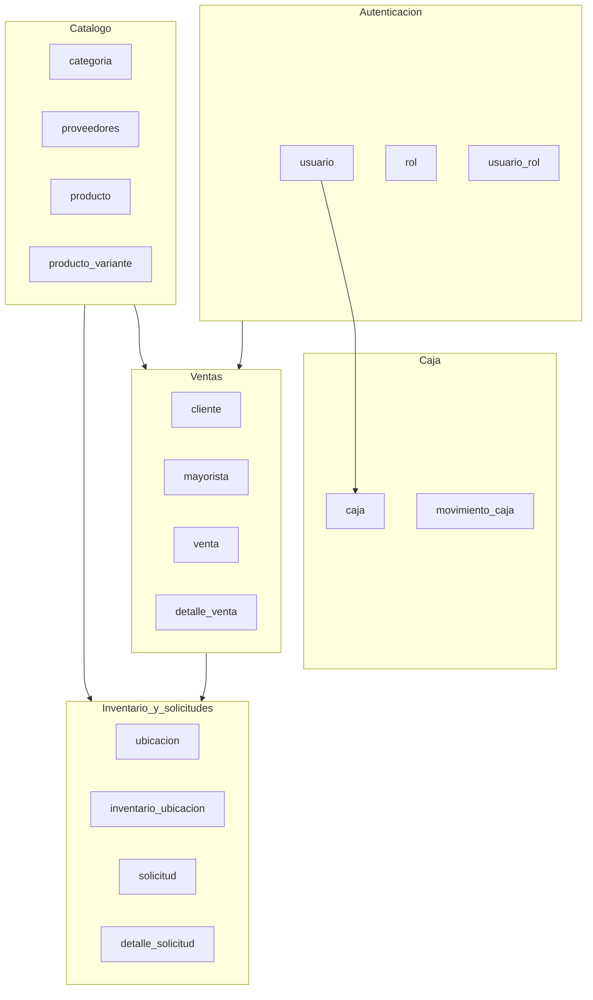

# Base de datos — diagrama entidad-relación (actualizado)

**Motor:** PostgreSQL (p. ej. base `tiendaropadk` según `application.properties`).  
**Esquema:** Flyway en `Back-End/src/main/resources/db/migration/` + entidades JPA en `Back-End/src/main/java/com/tienda/ropa/entity/`.  
**Datos de apoyo en migraciones:** ubicación **Principal** (V7), usuario técnico **SISTEMA** (V7), ubicación **Almacén** por defecto (V9), pisos/áreas de ejemplo (V10).

## Convención de pisos y áreas (sin DDL nuevo)

La tabla `ubicacion` ya basta para representar pisos y sus áreas:

| Columna | Uso |
|---------|-----|
| `nombre` | **Piso** (`Piso 1`, `Piso 2`, …) o ubicación reservada (`Principal`, `Almacén`). |
| `area` | **Espacio** dentro del piso (`Vitrina`, `Probador`, etc.). Puede ser `NULL` en filas reservadas. |
| `descripcion` | Notas opcionales. |

- Varias filas pueden compartir el mismo `nombre` (mismo piso) y diferir en `area`: V7 no impone `UNIQUE` sobre `nombre`.
- **Reservados** para lógica de negocio: `Principal` (descuento de venta POS) y `Almacén` (recepción / origen de reposición automática). En los listados de "pisos" del módulo almacén se **excluyen**.
- **Stock inicial** al crear/editar variantes se registra en **Almacén**; el cajero sigue descontando de **Principal**; el almacén usa **traslado inmediato** para mover stock entre `Almacén` y áreas de piso.

---

## Diagrama ER (tablas y relaciones principales)

```mermaid
erDiagram
    usuario {
        bigint id_usuario PK
        varchar usuario UK
        varchar password
        boolean activo
    }
    rol {
        bigint id_rol PK
        varchar nombre_rol UK
    }
    usuario_rol {
        bigint id_usuario FK
        bigint id_rol FK
    }

    categoria {
        bigint id_categoria PK
        varchar nombre
        bigint categoria_padre_id FK
    }

    proveedores {
        bigint id_proveedor PK
        varchar nombre
        varchar ruc UK
    }

    producto {
        bigint id_producto PK
        varchar codigo_identificacion UK
        bigint id_subcategoria FK
        bigint id_sub_categoria2 FK
        bigint id_categoria_padre FK
        bigint id_proveedor FK
        text descripcion
    }

    producto_variante {
        bigint id_producto_variante PK
        bigint id_producto FK
        varchar color
        varchar talla
        varchar sku UK
        varchar codigo_barras
        int cantidad
    }

    ubicacion {
        bigint id_ubicacion PK
        varchar nombre
        varchar area
        text descripcion
    }

    inventario_ubicacion {
        bigint id_inventario_ubicacion PK
        bigint id_variante FK
        bigint id_ubicacion FK
        int stock_actual
        int stock_minimo
        int stock_maximo
    }

    cliente {
        bigint id_cliente PK
        varchar nombre_cliente
        varchar tipo_cliente
        varchar numero_documento UK
    }

    mayorista {
        bigint id_cliente PK_FK
        varchar codigo_mayorista UK
    }

    venta {
        bigint id_venta PK
        bigint id_usuario FK
        bigint id_cliente FK
        varchar metodo_pago
        varchar tipo_comprobante
        timestamp fecha_venta
        decimal total_ventas
    }

    detalle_venta {
        bigint id_detalle_venta PK
        bigint id_venta FK
        bigint id_producto_variante FK
        int cantidad
        decimal precio_unitario
    }

    caja {
        bigint id_caja PK
        bigint id_usuario FK
        timestamp fecha_apertura
        decimal monto_apertura
        varchar estado
        varchar numero_operacion UK
    }

    movimiento_caja {
        bigint id_movimiento PK
        bigint id_caja FK
        varchar tipo_movimiento
        decimal monto
        bigint referencia_id
    }

    solicitud {
        bigint id_solicitud PK
        bigint id_usuario FK
        varchar tipo_solicitud
        varchar estado
        bigint id_ubicacion_origen FK
        bigint id_ubicacion_destino FK
        timestamp fecha_creacion
    }

    detalle_solicitud {
        bigint id_detalle_solicitud PK
        bigint id_solicitud FK
        bigint id_variante FK
        int cantidad
    }

    usuario ||--o{ usuario_rol : tiene
    rol ||--o{ usuario_rol : asigna

    usuario ||--o{ venta : registra
    cliente ||--o{ venta : compra
    venta ||--|{ detalle_venta : lineas
    producto_variante ||--o{ detalle_venta : vendido_como

    usuario ||--o{ caja : opera
    caja ||--o{ movimiento_caja : movimientos

    cliente ||--|| mayorista : extension_1a1

    categoria ||--o{ categoria : padre_hijo
    categoria ||--o{ producto : subcategoria
    categoria ||--o{ producto : subcategoria2
    categoria ||--o{ producto : categoria_padre
    proveedores ||--o{ producto : provee

    producto ||--|{ producto_variante : variantes

    producto_variante ||--o{ inventario_ubicacion : stock_por_ubicacion
    ubicacion ||--o{ inventario_ubicacion : almacena

    usuario ||--o{ solicitud : solicita
    ubicacion ||--o{ solicitud : origen
    ubicacion ||--o{ solicitud : destino
    solicitud ||--|{ detalle_solicitud : lineas
    producto_variante ||--o{ detalle_solicitud : variante
```

---

## Flujo por dominio (lectura rápida)



Tras registrar una **venta**, el backend descuenta stock en la ubicación **Principal** (`inventario_ubicacion`) y, si `stock_actual <= stock_minimo`, puede crear una **solicitud** tipo `REPOSICION` (usuario `SISTEMA`) desde una ubicación de almacén hacia Principal, si existe una segunda ubicación (p. ej. **Almacén** insertada por V9).

El **módulo almacenero** trabaja sobre filas `ubicacion` cuyo `nombre` no es reservado (`Principal`, `Almacén`): cada `nombre` distinto se interpreta como un **piso** y cada fila con ese `nombre` aporta un `area`. La acción "Mover mercadería" ejecuta un **traslado inmediato** que decrementa `inventario_ubicacion` de la ubicación origen y suma a la destino dentro de la misma transacción, sin pasar por la tabla `solicitud`.

---

## Tablas sin bloque ER arriba

- Convención Spring para nombres físicos: muchas tablas siguen **snake_case** en PostgreSQL (`detalle_venta`, `usuario_rol`, etc.).
- Enum en aplicación: `tipo_solicitud` (`VENTA`, `REPOSICION`), `estado` solicitud (`PENDIENTE`, `ATENDIDO`, `CANCELADO`), `nombre_rol` alineado con enum Java `Role`.

---

*Generado para el módulo Back-End del sistema de ventas (tienda de ropa). Actualizar este archivo si cambian migraciones o entidades.*
