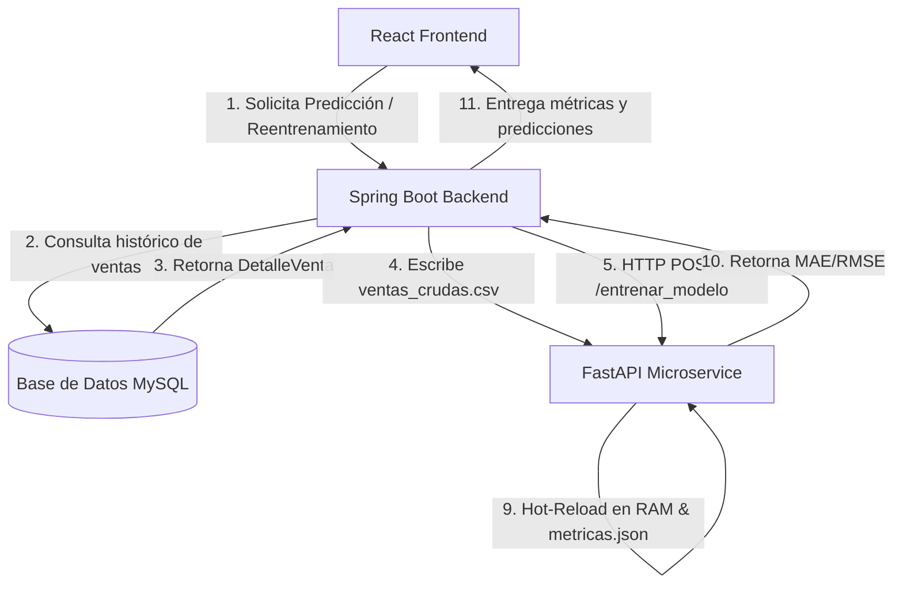

# Documentación Técnica de la Arquitectura de IA y Manual de MLOps - Sistema Dakani

Este documento proporciona una guía completa y detallada de la arquitectura, conectividad, instalación y uso de la solución de Inteligencia Artificial para la predicción de demanda e inventarios implementada en el sistema **Dakani**. Está estructurado de forma que cualquier desarrollador u otra Inteligencia Artificial pueda comprender el flujo de datos extremo a extremo y generar la documentación formal del proyecto.

---

## 1. Arquitectura de la IA y el Algoritmo

### 1.1 Modelo Predictivo
El núcleo del algoritmo de predicción es un regresor **XGBoost (eXtreme Gradient Boosting)** (`xgb.XGBRegressor`), un modelo basado en árboles de decisión optimizados por gradiente. Es especialmente eficiente para datos estructurados de series de tiempo y transacciones de ventas debido a su velocidad, capacidad de manejar relaciones no lineales y control de sobreajuste.

### 1.2 Estructura y Feature Engineering (Ingeniería de Características)
El modelo predice la **cantidad vendida** semanal de una variante específica de producto. Las características (features) utilizadas son:

| Característica | Tipo | Descripción |
| :--- | :--- | :--- |
| `ID de Producto` | Entero (int) | Identificador único del producto base en la base de datos de Dakani. |
| `color_num` | Entero (int) | Representación numérica del color, codificada mediante `LabelEncoder` (ajustado sobre el catálogo). |
| `talla_num` | Entero (int) | Representación numérica de la talla, codificada mediante `LabelEncoder` (ajustado sobre el catálogo). |
| `semana_ano` | Entero (int) | Número de la semana del año (1 a 53) extraída de la fecha utilizando la norma ISO-8601 (`isocalendar`). |
| `es_campana` | Binario (0 o 1) | Indicador binario si la fecha pertenece a una temporada de alta demanda comercial: <br>- *Navidad y Año Nuevo*: 15 de diciembre al 5 de enero.<br>- *Campaña Escolar*: Todo el mes de marzo.<br>- *San Valentín*: 10 al 20 de febrero.<br>- *Fiestas Patrias*: 22 al 31 de julio. |
| `ventas_semana_pasada` | Decimal/Entero | Característica de rezago (*lag feature*) que representa la cantidad total vendida de esa variante exacta en la semana anterior. Se inicializa en `0` si es el primer registro de la serie temporal. |

*Variable Objetivo (Target):* `cantidad_vendida` (cantidad física total de prendas vendidas en la semana).

---

## 2. Flujo de Datos y Conectividad (MLOps Pipeline)

El ciclo de entrenamiento y predicción (pipeline MLOps) integra tres capas principales:



### 2.1 Fase de Entrenamiento y MLOps (Ciclo Completo)
1. **Disparador:** 
   - **Manual:** Un Administrador presiona "Reentrenar IA" en el Frontend de React.
   - **Automático (Cron Job):** Spring Boot ejecuta una tarea programada el día 25 de cada mes a las 3:00 a.m. (`@Scheduled(cron = "0 0 3 25 * *")`).
2. **Exportación de Datos (Spring Boot):** 
   - `MlopsPipelineService` realiza una consulta a la tabla `detalle_venta` obteniendo todos los registros (`DetalleVentaRepository.findAll()`).
   - Se procesan y escriben en formato CSV en la ruta física configurada (`ventas_crudas.csv`), utilizando comillas dobles y delimitado por punto y coma (`;`).
3. **Petición HTTP:** Spring Boot realiza una petición `POST` al endpoint `/entrenar_modelo` del microservicio de FastAPI.
4. **Ejecución del Pipeline en Python:** 
   - Se ejecuta el script `preparar_datos.py` mediante un subproceso (`subprocess.run`), el cual lee `ventas_crudas.csv`, extrae la semana/año, inyecta las campañas comerciales, calcula el rezago (`shift(1)`) y ajusta/guarda los codificadores `encoder_color.pkl` y `encoder_talla.pkl`.
   - Se ejecuta el script `entrenar_modelo.py` que entrena el XGBoost Regressor (con 1500 estimadores, profundidad máxima 10, tasa de aprendizaje 0.01) dividiendo el dataset 80/20.
   - Genera el cerebro binario `modelo_dakani.json` y calcula las métricas de error: **MAE (Error Absoluto Medio)** y **RMSE (Raíz del Error Cuadrático Medio)**, guardándolas en `metricas_modelo.json`.
5. **Hot-Reload (Recarga en Caliente):** FastAPI carga inmediatamente en RAM el nuevo archivo de modelo y codificadores sin necesidad de reiniciar el microservicio.
6. **Respuesta de Métricas:** Devuelve a Spring Boot un JSON con el estado de éxito y los valores reales de MAE y RMSE obtenidos.

### 2.2 Fase de Predicción en Lote
1. Desde el panel de planificación de compras del frontend, al pulsar "Realizar Predicción IA", React construye un array de peticiones con la variante de producto, color, talla, semana objetivo y las ventas de la semana pasada de las variantes activas.
2. React envía una petición POST al endpoint de Spring Boot, el cual actúa de pasarela consumiendo el endpoint `/predecir_lote` de FastAPI.
3. El microservicio de Python codifica los textos a sus valores numéricos usando los pickle de LabelEncoder en memoria, pasa el DataFrame al modelo cargado, redondea los resultados de regresión y devuelve un array con la predicción sugerida para cada variante.

---

## 3. Manual de Instalación y Despliegue

### 3.1 Microservicio de Python (FastAPI)
#### Prerrequisitos
* Python 3.9 o superior instalado.
* Gestor de paquetes `pip` o `uv`.

#### Pasos para la Instalación
1. Abrir una terminal en la ruta de la carpeta del microservicio: `cd dakani`
2. Crear un entorno virtual de Python:
   ```bash
   python -m venv .venv
   ```
3. Activar el entorno virtual:
   - **En Windows (PowerShell):** `.venv\Scripts\Activate.ps1`
   - **En Linux/macOS:** `source .venv/bin/activate`
4. Instalar las dependencias requeridas:
   ```bash
   pip install fastapi uvicorn xgboost pandas scikit-learn joblib pydantic
   ```
5. Comprobar que los scripts de preparación estén en la carpeta base y el servidor FastAPI dentro de `api_ia/`.
6. Arrancar el servidor en modo desarrollo:
   ```bash
   cd api_ia
   uvicorn main:app --host 0.0.0.0 --port 8000 --reload
   ```
   *Nota: Por defecto, el microservicio corre en `http://localhost:8000`.*

---

### 3.2 Backend de Java (Spring Boot)
#### Prerrequisitos
* Java Development Kit (JDK) 17 o superior.
* Maven 3.6+ o Maven Wrapper integrado.

#### Pasos para la Configuración e Instalación
1. Configurar la integración en el archivo [application.properties](file:///c:/Users/Gonzalo/Desktop/proyectoIntegrador/Back-End/src/main/resources/application.properties):
   ```properties
   # Ruta física absoluta donde Spring Boot guardará el CSV para que Python lo lea
   dakani.mlops.csv-path=c:/Users/Gonzalo/Desktop/proyectoIntegrador/dakani/api_ia/ventas_crudas.csv

   # URL de endpoint de reentrenamiento del microservicio Python
   dakani.mlops.fastapi-url=http://localhost:8000/entrenar_modelo
   ```
2. Asegurar la inyección del bean `RestTemplate` en la clase de configuración de Spring Boot para llamadas HTTP externas.
3. Compilar el proyecto y resolver dependencias:
   ```bash
   ./mvnw clean compile
   ```
4. Ejecutar el backend:
   ```bash
   ./mvnw spring-boot:run
   ```
   *El backend de Spring Boot se ejecutará típicamente en `http://localhost:8080`.*

---

### 3.3 Frontend de React (Vite / TypeScript)
#### Prerrequisitos
* Node.js v16 o superior.
* Gestor de paquetes `npm` o `yarn`.

#### Pasos para la Instalación
1. Navegar al directorio de React: `cd front-end/sistemaReact-Main`
2. Instalar la dependencia necesaria para exportación de archivos Excel (`xlsx`):
   ```bash
   npm install xlsx
   ```
3. Asegurar que las llamadas al API utilicen la ruta `/api/admin/reportes/mlops/` (mapeada a través del proxy configurado en `vite.config.ts` o llamando directamente al backend en `http://localhost:8080`).
4. Compilar y arrancar la aplicación de desarrollo:
   ```bash
   npm run dev
   ```

---

## 4. Manual de Usuario del Módulo de IA

El módulo de Inteligencia Artificial se encuentra integrado dentro de la sección **Reportes -> Inventario y Demanda** de la plataforma web.

### 4.1 Subpestaña 1: Stock General
* Permite visualizar el inventario consolidado de los productos base.
* Cuenta con botones de filtrado rápido por estados de stock:
  - **Sobreestock** (Stock > 180 unidades) - Color Verde.
  - **Stock Normal** (Stock entre 30 y 180 unidades) - Color Azul.
  - **Bajo Stock** (Stock < 30 unidades) - Color Rojo (Crítico).

### 4.2 Subpestaña 2: Predicción de Demanda
* **Métricas de Precisión:** Muestra las métricas reales del cerebro de IA.
  - **MAE (Error Absoluto Medio):** Desviación promedio esperada por el modelo sobre las unidades físicas de venta.
  - **RMSE (Raíz de Error Cuadrático Medio):** Penalizador de desviaciones grandes.
* **Calibración y Reentrenamiento (Solo Administradores):**
  - Si tu usuario posee rol `ROLE_ADMIN`, visualizarás habilitado el botón **Reentrenar IA**.
  - Al presionarlo, el sistema exportará el historial actualizado de ventas, reajustará el algoritmo en Python y recargará las nuevas métricas automáticamente en el panel superior.
* **Ajuste de Stock de Seguridad:**
  - Deslizador (*slider*) configurado de `0` a `30`.
  - Se autocalibra inicialmente con el valor del MAE redondeado. Permite al usuario ajustar de forma manual la tolerancia de inventario extra para mitigar el error esperado de la IA.
* **Predicción IA y Compras:**
  - Al pulsar **Realizar Predicción IA**, se cargan las proyecciones y se visualiza en la tabla de variantes como: `Predicción ± MAE` (ejemplo: `7 ± 3`).
  - La columna **A Comprar** muestra la cantidad de piezas sugeridas a ordenar basada en la demanda futura y el stock de seguridad.

### 4.3 Modal de Configuración y Exportación a Excel
Al pulsar el botón **Exportar Excel** en la sección de predicciones de demanda, se abre un diálogo modal moderno que permite configurar detalladamente el archivo de salida:

1. **Configuración de Hojas:** Selecciona cuáles pestañas deseas generar en un único libro de Excel:
   - *Inventario General* (Marcado por defecto): Listado de todas las variantes con código, color, talla y stock actual.
   - *Alto Stock*: Listado de productos base con stock mayor a 180.
   - *Stock Normal*: Listado de productos base con stock entre 30 y 180.
   - *Bajo Stock*: Listado de productos críticos base con stock menor a 30.
   - *Predicción de Demanda* (Marcado por defecto): Hojas estructuradas con columnas simplificadas: `Producto`, `Color`, `Talla` y `Stock a Pedir`.
2. **Opción de Stock de Seguridad:** En la hoja de predicción, puedes marcar si deseas incluir el stock de seguridad en el cálculo del `Stock a Pedir` o basarlo únicamente en la predicción directa de demanda del modelo de IA.
3. **Estructura del Archivo (Vista Previa):** En el lateral derecho, el modal muestra de forma dinámica la cantidad exacta de registros y hojas que se inyectarán en tiempo real de acuerdo a la configuración activa y los filtros del sistema.
